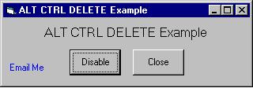

<div align="center">

## ALT CTRL DEL Example


</div>

### Description

To demonstrate how easy it is to disable the ALT CTRL DEL buttons

The basic emailer included will show you how to add the functionality of email to your programs. Check it out & don't forget to vote!
 
### More Info
 


<span>             |<span>
---                |---
**Submitted On**   |2002-08-20 19:13:34
**By**             |[crouchie](https://github.com/Planet-Source-Code/PSCIndex/blob/master/ByAuthor/crouchie.md)
**Level**          |Beginner
**User Rating**    |3.0 (30 globes from 10 users)
**Compatibility**  |VB 6\.0
**Category**       |[Custom Controls/ Forms/  Menus](https://github.com/Planet-Source-Code/PSCIndex/blob/master/ByCategory/custom-controls-forms-menus__1-4.md)
**World**          |[Visual Basic](https://github.com/Planet-Source-Code/PSCIndex/blob/master/ByWorld/visual-basic.md)
**Archive File**   |[ALT\_CTRL\_D1203548202002\.zip](https://github.com/Planet-Source-Code/crouchie-alt-ctrl-del-example__1-38125/archive/master.zip)

### API Declarations

```
Private Declare Function SystemParametersInfo Lib "user32" Alias "SystemParametersInfoA" (ByVal uAction As Long, ByVal uParam As Long, ByRef lpvParam As Any, ByVal fuWinIni As Long) As Long
Private Declare Function ShellExecute Lib "shell32.dll" Alias "ShellExecuteA" (ByVal hwnd As Long, ByVal lpOperation As String, ByVal lpFile As String, ByVal lpParameters As String, ByVal lpDirectory As String, ByVal nShowCmd As Long) As Long
```


